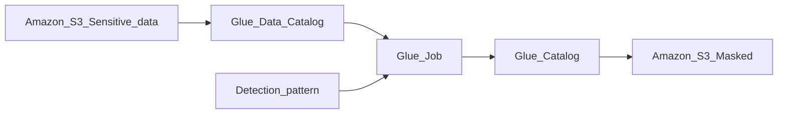

## What is Sensitive Data?
Sensitive data refers to information that enables the identification of an individual through unique identifiers, such as Social Security Numbers (SSN), Aadhar numbers, PAN numbers, driver's licenses, biometrics, and phone numbers.

When conducting data analytics, there is typically no requirement to include this kind of information. As a result, the approach involves identifying this sensitive data and applying a hashing process to it using an Extract, Transform, Load (ETL) Job.

The data obtained from a source is first sent to AWS Glue, where the sensitive data is detected, transformed, and subsequently transmitted to the data lake for storage and analysis.

## Transforming the data
Sensitive data can be managed through two primary methods:
1. Masking and Hashing.
2. Implementing restricted access controls for areas containing sensitive data.

## Handling Sensitive data in Glue Job
AWS offers a transformation tool called "Detect PII," which is designed to automatically identify sensitive data. When designing workflows, integrating the "Detect PII" transformation can simplify the process of identifying sensitive information. Once identified, there are typically three common approaches to handling such data:

1. **Alert Notification:** You can configure the system to generate an alert or notification when sensitive data is detected. This serves as a warning mechanism, allowing you to take appropriate actions in response to the presence of sensitive information.

2. **Data Masking:** For privacy and security purposes, you can apply data masking to sensitive data. This involves replacing the actual sensitive content with a predefined format, such as "***." This way, the original data is concealed, and only authorized individuals can access the unmasked version.

3. **Cryptographic Hashing:** Another approach is to apply cryptographic hashing to sensitive data. This involves transforming the data into a fixed-length, irreversible string of characters. Hashed data cannot be easily reversed to reveal the original content, providing a secure way to store and manage sensitive information.

These three methods provide flexibility in how you handle sensitive data, allowing you to choose the most appropriate approach based on your specific security and compliance requirements.

## How is masking done?
Data masking is a technique used to obscure or replace sensitive information in a way that conceals the original data while preserving its format. In your example JSON data, here's how masking is done:

Original JSON Data:
```json
{
  "name": "Teja Ravipudi",
  "email": "krish@mail.com",
  "country": "United States",
  "phone": "0987654321"
}
```

After Applying Data Masking:
```json
{
  "name": "Teja Ravipudi",
  "email": "***",
  "country": "United States",
  "phone": "***"
}
```

In this example, the sensitive information (email and phone number) has been masked using asterisks ("***"). The masking process retains the original data's structure and length while replacing the sensitive parts with a standard masking pattern to protect the privacy and security of the information. This way, the masked data can still be used for certain purposes without exposing the sensitive details.

## Types of Sensitive data
The "Detect PII" transformation in AWS supports the identification and handling of various types of sensitive data. Here is a list of some common sensitive data types that are supported by this transformation:

1. **Email:** Detection and handling of email addresses.
2. **Credit Card:** Identification and protection of credit card numbers.
3. **Driving License:** Recognition and safeguarding of driver's license numbers.
4. **IP Address:** Detection and management of IP addresses.
5. **Passport:** Identification and secure handling of passport numbers.
6. **Bank Details:** Recognition and protection of bank account information.
7. **18 HIPAA Identifiers:** Detection and handling of sensitive healthcare-related information as defined by the Health Insurance Portability and Accountability Act (HIPAA).

If you have data that needs to be masked, but it doesn't fall into one of these predefined categories, you have the flexibility to create your own detection pattern. To do this, you can define a custom pattern using regular expressions, allowing you to identify and protect specific types of sensitive information unique to your use case. This customization ensures that you can tailor the "Detect PII" transformation to suit your specific data protection needs.


## Workflow



## Procedure
Initially, you should create an S3 bucket with two folders: one named "customers" containing a file called "customers.csv" with sensitive data, and the other named "output." Your goal is to retrieve and process the data, identifying sensitive information using the "Detect PII" transformation, and then store the results in the "output" folder.

The "customers.csv" file includes columns for ID, name, message (containing sensitive data), and email addresses. Your workflow should identify and mask or hash email addresses, as well as detect sensitive information within the message column and apply masking or hashing specifically to that sensitive content.

Here's a sample table with the data:

| ID | NAME     | MESSAGE                         | EMAIL            |
|----|----------|---------------------------------|------------------|
| 1  | krish    | krish@mail.com sent to me      | krish@mail.com   |
| 2  | Ram      | Hello Ram@mail.com sent        | Ram@mail.com     |
| 3  | Lakshman | HI lakshman@mail.com sent      | lakshman@mail.com|
| 4  | sita     | Bye sita@mail.com sent         | sita@mail.com    |
| 3  | ravan    | Good night ravan@mail.com sent | ravan@mail.com   |

Additionally, there is non-standard sensitive data in the form of numbers like "123-234." To detect this unique data, you'll need to create a custom regex pattern for its identification within the dataset.

## Creating a detection pattern
Proceed to the AWS Glue console and access the "Sensitive Data Detection" feature within the "Data Integration and ETL" section. In this section, you should input a pattern name, for instance, let's call it "Number_detect." Following that, you'll need to define a regular expression (regex) pattern to identify the desired data format, like `\d{3}-\d{3}`, and then create the pattern. This pattern will be used to detect and manage data matching this specific format within your dataset.

To create an AWS Glue ETL job, follow these steps:

1. Go to the AWS Glue console and access the "ETL jobs" section. Create a "Visual ETL" job with a blank canvas.

2. In the job details, specify the following configurations:
   - Job name: "sensitive_job."
   - IAM role: Create an IAM role that grants access to AWS services for Glue and attach it to this job. Leave other settings as default and save the job.

3. In the "Visual" section:
   - Choose the data source, such as the "Glue Data Catalog."
   - In the source properties, select the database, which you created using the Glue crawler. Choose the appropriate database and table.

4. Configure the "Detect PII" action:
   - In the "Action" section, select "Detect PII."
   - In the properties of "Detect PII," choose "Find sensitive data in each row."
   - Under "Types of sensitive information to detect," select "Include all available types (178)."
   - In the action settings, opt for "Redact detected text (Masking)" and specify the masking string (e.g., "*****").

5. Specify the target:
   - Choose an S3 bucket for saving the results.
   - In the target configuration, set the format to CSV, and define the target location as the "output" folder within the S3 bucket.

6. Optionally, save the data to a database:
   - In the "Data catalog update options," select "Create a new table in the data catalog and on subsequent runs updates the schema and add new partitions."
   - Attach the Glue database and provide a table name for the resulting data, such as "customers_sensi_free."

7. Save the job configuration.

8. Run the job. The results will be stored in the specified S3 bucket in CSV format, and if configured, in the "customers_sensi_free" table within the Glue Data Catalog.

You can access the results in both the S3 bucket and the database table for further analysis and use.
