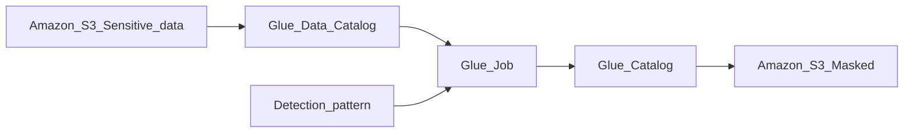

## What is Sensitive Data?
The data which we used to find some person using some unique information is called the sensitive data. The data might be SSN, Aadhar number, PAN, Drivers license, biometrics, phone number etc.

When we are performing some analytics these information is not needed. so we need to show this information. so we are going to detect this data and hash them using an ETL Job.

The data which we get from a source will be sent to the AWS Glue and then the sensitive data is detected, transfored and then send it to the data lake.

## Transforming the data
The sensitive data can be handled in two ways:
- Masking, Hashing.
- Giving restricted access where we have sensitive data.

## Handling Sensitive data in Glue Job
The AWS gives us a transformation called `Detect PII` where it can find the sensitive data. when we are designing some workflows, if we can just put our `Detect PII` it will find out the sensitive and we can handle them in the following 3 ways:
- we can just set an alert that there is sensitive data.
- Apply Masking to the data with some pre-entered format. "***"
- Apply Cryptographic hashing to the sensitive data.

## How is masking done?
Let suppose the data be as follows:
```Json
{
"name" : "Teja Ravipudi",
"email" : "krish@mail.com",
"country" : "United States",
"phone" : "0987654321"
}
```
The transformation which we have created will Mask the above data as follows:
```Json
{
"name" : "Teja Ravipudi",
"email" : "***",
"country" : "United States",
"phone" : "***"
}
```

## Types of Sensitive data
There are multiple types of sensitive data that are supported by the `Detect PII` transformation. The following are the list of them:
- Email
- Credit Card
- Driving License
- IP address
- Passport
- Bank Details
- 18 HIPAA identifiers

If there is any data which you want to mask but that is not in the above list, you can create your own detection pattern. you need to create a Pattern by entering the regular expression.


## Workflow



## Procedure
Firstly we need to setup a S3 bucket, Where i will be having two folders. The firstly is `customers/customers.csv` and the second folder is `output`. The `customers.csv` will be having some sensitive data in it. now we need to extract the data and detect the sensitive information uisng the `Detect PII` transformation and save it to the ouptut folder.

Let suppose the data in the customers.csv file be: 
- id
- name
- message (with some sensitive information)
- email (sensitive information)

The workflow should detect the email and mask/hash and also detect the the sensitive information in the message and mask/hash only that particular information. The sample data be as follows:

| ID | NAME | MESSAGE | EMAIL |
| -- | ---- | ------- | ----- |
| 1 | krish | krish@mail.com sent to me | krish@mail.com |
| 2 | Ram | Hello Ram@mail.com sent | Ram@mail.com |
| 3 | Lakshman | HI lakshman@mail.com sent | lakshman@mail.com |
| 4 | sita | Bye sita@mail.com sent | sita@mail.com |
| 3 | ravan | Good night ravan@mail.com sent | ravan@mail.com |

Let suppose, The above information consits of some email id and some numbers `123-234`, for instance lets think the number to be the sensitvie data and we need to detect them. But the data here is not matching to any of the option which the `Detect PII` would detect. so for this data we need to create a custom regex to detect them in the data.

## Creating a detection pattern
Navigate to the AWS Glue console, in the `Data Integration and ETL` section you will find sensitive data detection.
There you need to enter your pattern name, Ex: `Number_detect`. And we need to write a regex to match the pattern `\d{3}-\d{3}` and create the pattern.

## Creating the ETL Glue Job
Navigate to AWS Glue console, in the `ETL jobs` section you will find the `Visual ETL`, and then create a `Visual with black canvas`. 
In the Job details section enter the following configurations:
- name : sensitive_job
- IAM role : Create an IAM role which you can use for accessing the AWS services with Glue and just attach that role to this job.
and just leave all the other configurations to default and save that.

In the `Visual` Section, firstly you need to choose the source like from the data is coming from. I will choose that to be `Glue Data Catalog`. In the properties of that source you need to select the database. There you need to select the database and select the table. 

> Note: Here the database is the one which you create it in the AWS Glue. Using the crawler i will read the csv file in the bucket and create a table in the AWS Glue table.

Now that you have the data ready and you need to detect that data. In the `Action` section you need get your `Detect PII`. Now you need to configure this action.
In the properties of that `Detect PII` you can find the choice where you can select between "Find sensitvie data in each row" and "Find columns that contain sensitive data". I will be selecting the `Find sensitvie data in each row`. 

Moving forward we have **Types of sensitve information to detect**. there i will selecting the "Include all available types(178)". And then in the Actions, I will just Redact detected text (Masking), and you need to specify the string which you wanted to mask it with. Ex: "*****".

Then I need to specify the Target, Where should the results be saved to? 
I want the data to be saved to S3 bucket. so in the `Target` Section i will select the S3 bucket. In the configuration of the target i will put the format type to be CSV, and the target location to be the `output` folder in the s3 bucket. 

For instance i also wanted the same data to be saved in the database. In the "Data catalog update options", I will choose the `Create a new table in the data catalog and on subsequent runs updates the schema and add new partitions`.  Then i need to attach the database in the glue,  and give the table name for the result `customers_sensi_free`. 

Save the Job and Run the Job.
You can find your results in the S3 Bucket and the database table `customers_sensi_free` which you have created recently.