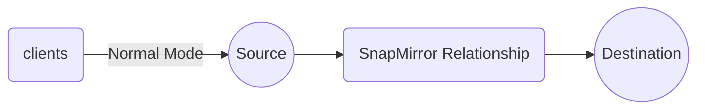

## What is Snap Mirroring?
This technology is employed within ONTAP software, operating in an **asynchronous** manner. Initially, data is transmitted from the source volume to the destination volume to synchronize them, ensuring they match. At regular intervals, the destination volume retrieves the latest updates from the source. It's possible for some delay or "LAG" to occur during this process.

SnapMirror leverages NetApp's `Snapshot` technology as an integral component of the replication process.

```
What is a Snapshot?
A Snapshot is essentially a read-only image of data captured at a specific moment in time. It serves as a static, read-only representation of the state of a volume at a particular point in time.

```

## Components of Snap Mirror Relationship
This system comprises two volumes: the source and the destination. These volumes can exist either within the same cluster (intra-cluster) or in separate clusters (inter-cluster).

For example, consider a cluster named `c1` with four nodes: `n1, n2, n3, n4`, paired as `n1->n2` and `n3->n4`. Intra-cluster operations occur when you mirror data from `n1` to `n3` within the same cluster.

In the case of another cluster, `c2`, with a pair of nodes like `n5->n6`, mirroring data from `n1` in `c1` to `n5` in `c2` is termed an inter-cluster operation.

```
Note: SVM (Storage Virtual Machine)
Every time you create a volume, it's placed within an SVM, which acts as a container for volumes. SVMs help abstract the internal cluster configuration from clients, allowing you to present the SVM to the client.
```

When mirroring a volume within a cluster, you're essentially mirroring from one SVM to another SVM.

In cases where you have multiple volumes within one SVM and want to mirror only a specific volume to another SVM, this is referred to as "volume-level mirroring." However, before mirroring, you must establish a one-to-one connection between SVMs, known as "SVM Peering" or "Vserver Peers." The concepts discussed so far pertain to intra-cluster operations.

For inter-cluster mirroring, such as mirroring `v1` from `svm1` in `c1` to `svm2` in `c2`, you need to perform "Cluster Peering." Peering involves creating a communication link between the two entities, facilitating data exchange between clusters.

## How to use the Destination Volume
In the SnapMirror process, the source volume, which is part of one SVM, is mirrored to a destination volume in another SVM. The source volume retains its read/write capabilities, while the destination volume is set to read-only. This restriction means that you cannot perform any write or modification actions on the destination copies. However, SnapMirror provides a valuable feature by allowing you to utilize the destination volume to create what is known as a "FlexClone."

A FlexClone is essentially a clone of the destination volume. When you create a FlexClone, it captures a snapshot image of the destination volume and provides it with read/write access. This means you can perform various actions and modifications to the data within the FlexClone without affecting the source or destination volumes.

One significant advantage of this approach is that creating a clone from the destination volume doesn't impact the performance or integrity of the source volume. It allows for versatile use of the data while maintaining the security and stability of the source and destination volumes.

## SVM Peer Relationships
This SVM peering will only be done in the volume level. So, One SVM can be connected to multiple SVMs within a cluster or another clusters. Let suppose svm1 is connected to svm2 it can also be connected to svm3.

`SanpVault` - Its is a NetApp's disk to disk backup method.

`SnapMirror` - Its a replication concept.

Only snapmirror data protection and snapvalut extended data protection can be setup. And they work very **Similar**

> The SVM names in the peered clusters must be unique within the clusters.

## Steps to Configure SnapMirror Relationships
The first point that we need to remember is that creating a snapshot we doesn't require any license for that. But creating a mirror out of that snapshot we need a license.

1. Verify that SnapMirror licenses have been applied on both the sources and destination clusters.
2. Establish cluster and svm peering
3. select the destination cluster and SVM.
4. Create a data protection volume on the destination.
5. Select or create a mirror policy
6. select or create a schedule.
7. Create the relationship.
8. Initilize the relationship.

Once it goes through all the steps, it is successful in connecting to the other SVM. This is called `Baseline Transfer` 
```
What does the policy inlcude?

The default policy will be having the schedule details of how frequently that destination volume comes to source and check for the new updates.

Else you can create your own policy and schedules.
```

> When you are connected to the SVM and you are monitoring a Relationship and you see the lag time to be in negative values -> The Reason for that is because when the Destination SVM is located in another country, just becuase of the difference between the timezones, it will result in negative values.

 There are 3 types of mirroring:
 1. Data protection mirroring -> SnapMirror
 2. Extended data protection -> SnapVault
 3. Load sharing -> Mainly designed to replicate the root volume to the destination.

 The SVM root volume is generally referred as the namespace. When NFS or CIFS volumes are supposed to be accessed we obviously need the namespace to locate the data. The reason for using the load sharing is that, when you are working on a volume which has a read-only access to it then the namenode will not have any changes on that svm, then you can have a copy of that root for easy access of the the data in your svm. 

 Also, we can copy the whole svm which includes -> Root, volumes, data.

## Possible Errors in SnapMirror Technology
In the normal scenario the clients will be having the Read/write access only to the source volume, but not for the destination volume. The destination volume will only be having the Read only access.
The possible failure while using snap mirroring is:
- Operational Failures
- Application Failures
- Component Failures
- Site Failures
- Reagional Failures
 


In the dataprotection options from netapp, other than snapmirroring we will be having multiple conditions for the other clustering options. But in the snap mirror we will not be having any distance limit for mirroring the volume.

Let suppose there is failure occured in the source volume and the source volume goes `offline`. what could be the next step.

- The clients will now access the destination volume and then break the relationship with the source volume.

The moment you break the relationship, you need to direct the clients to use this destination volume. Also when the relation is broken there is no more source volume right, the volume which the clients are accessing now will be `new source volume` and will have the `read/write` access to the volume.
so at this particular instance, the original source volume is offline and the destination volume is the new source volume

Let suppose the original source volume is back online, and you need to give all his works to him back. Since the clients are working on the new source volume and the original source is back, you need to update all the changes back to the original source volume. so, to get the updated info to orignal source volume from the original destination, you need to run the following command in the original source volume.

> snapmirror resync

The main idea is that, once we got the original source volume back we wanted that to have the same work as before. To get this done it will create a temporary mirror relationship from the original destination to original source for the updates when it is offline.

Now we need to break that temporary mirror relationship and reverse the direction of the relationship. Now the relationship would be from the original source volume to the original destination volume.


