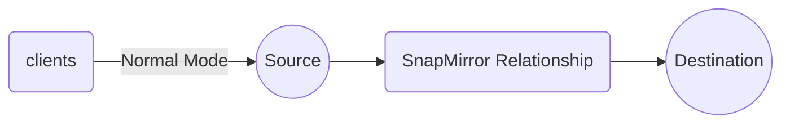

## What is Snap Mirroring?
This technology is employed within ONTAP software, operating in an **asynchronous** manner. Initially, data is transmitted from the source volume to the destination volume to synchronize them, ensuring they match. At regular intervals, the destination volume retrieves the latest updates from the source. It's possible for some delay or "LAG" to occur during this process.

SnapMirror leverages NetApp's `Snapshot` technology as an integral component of the replication process.

```
What is a Snapshot?
A Snapshot is essentially a read-only image of data captured at a specific moment in time. It serves as a static, read-only representation of the state of a volume at a particular point in time.

```

## Components of Snap Mirror Relationship
This system comprises two volumes: the source and the destination. These volumes can exist either within the same cluster (intra-cluster) or in separate clusters (inter-cluster).

For example, consider a cluster named `c1` with four nodes: `n1, n2, n3, n4`, paired as `n1->n2` and `n3->n4`. Intra-cluster operations occur when you mirror data from `n1` to `n3` within the same cluster.

In the case of another cluster, `c2`, with a pair of nodes like `n5->n6`, mirroring data from `n1` in `c1` to `n5` in `c2` is termed an inter-cluster operation.

```
Note: SVM (Storage Virtual Machine)
Every time you create a volume, it's placed within an SVM, which acts as a container for volumes. SVMs help abstract the internal cluster configuration from clients, allowing you to present the SVM to the client.
```

When mirroring a volume within a cluster, you're essentially mirroring from one SVM to another SVM.

In cases where you have multiple volumes within one SVM and want to mirror only a specific volume to another SVM, this is referred to as "volume-level mirroring." However, before mirroring, you must establish a one-to-one connection between SVMs, known as "SVM Peering" or "Vserver Peers." The concepts discussed so far pertain to intra-cluster operations.

For inter-cluster mirroring, such as mirroring `v1` from `svm1` in `c1` to `svm2` in `c2`, you need to perform "Cluster Peering." Peering involves creating a communication link between the two entities, facilitating data exchange between clusters.

## How to use the Destination Volume
In the SnapMirror process, the source volume, which is part of one SVM, is mirrored to a destination volume in another SVM. The source volume retains its read/write capabilities, while the destination volume is set to read-only. This restriction means that you cannot perform any write or modification actions on the destination copies. However, SnapMirror provides a valuable feature by allowing you to utilize the destination volume to create what is known as a "FlexClone."

A FlexClone is essentially a clone of the destination volume. When you create a FlexClone, it captures a snapshot image of the destination volume and provides it with read/write access. This means you can perform various actions and modifications to the data within the FlexClone without affecting the source or destination volumes.

One significant advantage of this approach is that creating a clone from the destination volume doesn't impact the performance or integrity of the source volume. It allows for versatile use of the data while maintaining the security and stability of the source and destination volumes.

## SVM Peer Relationships
SVM peering exclusively occurs at the volume level, allowing one SVM to connect with multiple SVMs, either within the same cluster or across different clusters. For instance, if SVM1 is connected to SVM2, it can also establish a connection with SVM3.

`SnapVault` is NetApp's disk-to-disk backup approach, while `SnapMirror` represents a replication concept. Both SnapMirror data protection and SnapVault extended data protection configurations are available and operate in a highly similar manner.

> It's essential to ensure that SVM names in the peered clusters remain unique within their respective clusters.

## Steps to Configure SnapMirror Relationships
The initial point to bear in mind is that creating a snapshot doesn't require any licensing, whereas the creation of a mirror from that snapshot necessitates a license.

1. Ensure that SnapMirror licenses are applied to both the source and destination clusters.
2. Establish cluster and SVM peering.
3. Select the destination cluster and SVM.
4. Create a data protection volume on the destination.
5. Choose or establish a mirror policy.
6. Select or establish a schedule.
7. Create the relationship.
8. Initialize the relationship.

Upon successfully completing all these steps, a connection to the other SVM is established, referred to as "Baseline Transfer."

**Policy Contents:**
The default policy includes schedule details for how frequently the destination volume checks the source for new updates. Alternatively, you can create your own policies and schedules.

> When monitoring a Relationship while connected to the SVM and observing negative lag time values, it is often due to time zone differences when the Destination SVM is located in another country.

There are three types of mirroring:
1. Data protection mirroring, known as SnapMirror.
2. Extended data protection, referred to as SnapVault.
3. Load sharing, primarily designed for replicating the root volume to the destination.

The SVM root volume is commonly referred to as the "namespace." When NFS or CIFS volumes need to be accessed, the namespace is essential for locating the data. Load sharing is useful when working with a volume that has read-only access, as it allows for a copy of the root volume to facilitate data access within your SVM.

Additionally, it is possible to replicate the entire SVM, including the root, volumes, and data.

## Possible Errors in SnapMirror Technology
Under normal circumstances, clients have read/write access only to the source volume and read-only access to the destination volume when using SnapMirror. Possible failures when employing SnapMirror include:

- Operational Failures
- Application Failures
- Component Failures
- Site Failures
- Regional Failures



<div class="mermaid" markdown="0" >
graph LR;
S((Source))
SR(SnapMirror Relationship)
D((Destination))
C(clients)
S --> SR --> D
C--> |Normal Mode|S
</div>

In NetApp's data protection options, apart from SnapMirroring, other clustering options may have various conditions. However, SnapMirror doesn't have a distance limit for mirroring volumes.

Suppose a failure occurs in the source volume, causing it to go offline. In that case, the following steps can be taken:

- Clients will start accessing the destination volume.
- The SnapMirror relationship with the source volume will be terminated.

Once the relationship is broken, clients will use the destination volume as the new source volume, which will have read/write access to the volume at this point. Therefore, the original source volume is offline, and the destination volume becomes the new source.

Now, if the original source volume comes back online, and you need to transfer all the changes back to it, you can run the following command in the original source volume:

> snapmirror resync

The primary objective is to restore the original source volume to its previous state. To achieve this, a temporary mirror relationship is created from the original destination to the original source for updates when it is offline.

Following this, you'll need to break the temporary mirror relationship and reverse the direction of the relationship. Consequently, the relationship will now be from the original source volume to the original destination volume.


